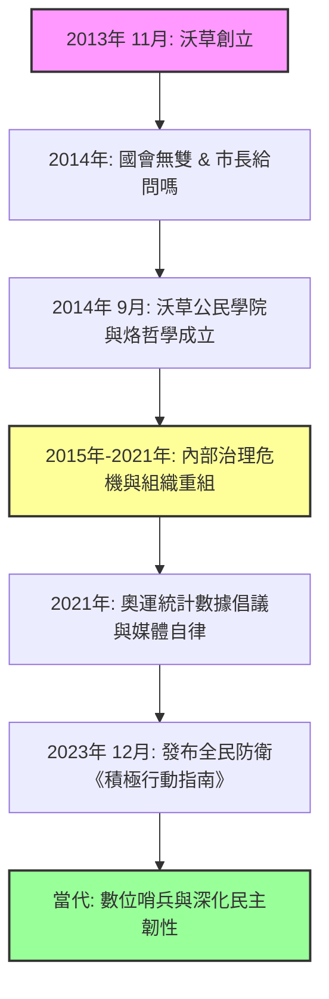

```yaml
title: '沃草：從國會無雙到全民防衛，台灣公民科技的十年實踐'
description: '成立於 2013 年的沃草（Watchout）是亞洲第一個監督政府運作的獨立網路平台。本文深度梳理沃草從議會直播、市長給問嗎到全民防衛倡議的發展脈絡與組織治理考驗。'
category: 'Society'
tags: ['沃草', 'Watchout', '公民科技', '獨立媒體', '數位民主', '國會無雙', '全民防衛']
author: 'Taiwan.md'
date: 2026-08-09
readingTime: 14
lastVerified: 2026-08-09
lastHumanReview: false
```

# 沃草：從國會無雙到全民防衛，台灣公民科技的十年實踐

> **30 秒概覽：** 成立於 2013 年 11 月的沃草（Watchout），是台灣公民科技（Civic Tech）與獨立媒體發展史上的重要里程碑[1](#user-content-fn-1)。作為亞洲第一個專注於監督政府運作的網路平台，沃草透過「國會無雙」、「市長，給問嗎」、「烙哲學」以及近年推動的全民防衛倡議《積極行動指南》，持續降低公民參與政治的門檻[1](#user-content-fn-1) [2](#user-content-fn-2)。本文從其創立初衷、核心專案、哲學普及、民防倡議到內部治理挑戰進行全方位梳理，展現其作為台灣「數位哨兵」的歷史定位與實踐省思。

在當代台灣的公民社會與數位民主浪潮中，**沃草有限公司（Watchout, Co.）** 佔據了極具標誌性的地位[1](#user-content-fn-1)。其名稱取自英文「Watch out」之諧音，原意為「提防與警戒」，核心宗旨即在於督促民意代表與政府官員，降低公民參與政治的門檻，並透過數位工具讓公共議題透明化[1](#user-content-fn-1) [3](#user-content-fn-3)。

作為台灣公民科技與獨立媒體運動的先行者之一，沃草透過國會監督、議題辯論、哲學普及與全民國防倡議，重塑了台灣民眾接觸政治資訊的方式。本文將深入探討沃草的發展脈絡、核心專案、組織轉折及其對台灣公民社會的深遠影響。

> **✦** 「沃草希望做一個農夫，提供公民更好的參與時政的平台和工具，在這公民社會的土壤施肥灌溉，讓這個理想的種子在每個人心中萌芽滋長，建立真正的公民社會。」—— 沃草官方願景[2](#user-content-fn-2)

---

## 發展脈絡與核心架構

為了直觀展現沃草自 2013 年創立至今的關鍵演進，以下透過架構圖梳理其十年發展軌跡：



---

## 緣起與核心宗旨：打造亞洲首個監督政府的平台

沃草於 2013 年 11 月正式創辦，標榜以社會企業形態經營，並定位為「亞洲第一個監督政府運作的獨立網路平台」[1](#user-content-fn-1)。在台灣歷經多次社會運動與公民覺醒的時代背景下，傳統媒體往往受限於商業利益或政治立場，難以對國會與行政機構進行即時、細緻的監督。沃草的誕生正是為了填補此一缺口，利用網路科技與開源精神，將生硬的政治議程轉化為大眾得以理解、監督的公共資訊。

其營運模式強調獨立自主與群眾支持，透過群眾募資、定期定額贊助及讀者支援維持營運，避免過度依賴單一財團或政黨，從而確保其新聞與評論的獨立性[3](#user-content-fn-3)。

---

## 核心專案：從國會無雙到數位參政的實踐

沃草在不同發展階段推出了多項深具影響力的數位民主與公共溝通專案，以下為其最具代表性的四大支柱：

### 國會無雙：打破資訊高牆的議事直播

立法院作為國家最高立法機關，其運作長期以來對一般民眾而言往往流於抽象。沃草推出的「國會無雙」專案，透過網路直播與即時文字轉播立法院議場質詢實況，將複雜的法案審查與政治攻防化繁為簡[4](#user-content-fn-4)。這種「把國會搬到網路上」的作法，讓選民得以直接檢視區域立委與不分區立委在國會中的表現，大幅提升了代議政治的透明度，亦逼使政治人物在質詢台上必須面對公眾的即時檢驗[4](#user-content-fn-4)。

### 市長，給問嗎：開創線上互動參政先河

在 2014 年台北市市長選舉期間，沃草開創了「市長，給問嗎」互動平台，邀請主要候選人直接在網路上回答網民提問[1](#user-content-fn-1)。該平台打破了傳統政見發表會單向傳播的侷限，落實了議題導向的選舉文化，並為後續台灣各界推動數位參與奠定了重要範例[1](#user-content-fn-1)。

### 沃草公民學院與烙哲學：深化思辨底蘊

為了深化公民社會的理性思辨基礎，沃草於 2014 年 9 月成立「沃草公民學院」，並由哲學家朱家安擔任主編，發展出「烙哲學」社群[3](#user-content-fn-3)。該社群透過淺顯易懂的哲學文章與漫畫，探討公共政策背後的核心價值與倫理原則，協助民眾建立扎實的批判性思維，防範民粹主義與錯誤資訊的侵蝕[3](#user-content-fn-3)。

### 數據倡議與全民國防《積極行動指南》

近年來，隨著地緣政治環境的轉變與混合戰爭威脅的加劇，沃草的關注焦點亦擴展至資訊戰防衛與全民國防教育。例如在 2021 年東京奧運期間，沃草引用統計數據分析國內各大電視台的報導傾向，引發社會對國家認同與媒體自律的廣泛討論[3](#user-content-fn-3) [5](#user-content-fn-5)。隨後在 2023 年 12 月，沃草發布了《積極行動指南》，結合民防概念，降低民眾理解民防知識、戰時心理衝擊與避難準備的門檻[3](#user-content-fn-3) [6](#user-content-fn-6)。這項倡議顯示沃草的角色已從單純的國會監督，進一步延伸至強化全體社會的防衛韌性。

---

## 組織治理與挑戰：從理想實踐到制度化重整

作為一家以社會企業自許的民間機構，沃草在發展過程中也曾面臨嚴峻的內部治理考驗與組織危機。

在 2015 年 6 月，沃草發布聲明指出時任執行長涉嫌未經授權挪用公款，隨即將其解職[5](#user-content-fn-5)。該事件引發社會對非營利組織及群眾募資財務透明度的高度關注。隨後，沃草委由會計師事務所進行全面財務查核，並公布相關報告以釐清帳目與募資資金流向[3](#user-content-fn-3) [7](#user-content-fn-7)。

此後，沃草歷經管理層的重組與調整。然而，在 2021 年 5 月，沃草再度發布重大聲明，指控當時的管理層涉嫌財務流向異常等情事[6](#user-content-fn-6)。沃草第一時間將其解職，並向司法機關提起相關法律訴訟[6](#user-content-fn-6)。

這兩起重大內部人事與財務風波，對沃草的品牌形象與營運穩定度造成了衝擊，但也促使台灣公民科技社群深刻反思組織治理、財務監督機制以及公共問責（Accountability）的重要性。在經歷多次風雨後，沃草透過董事會重組與營運團隊的專業化，持續在獨立媒體與公民社會中維持其發聲與監督功能。

---

## 歷史定位與未來展望

綜觀沃草十餘年的發展歷程，它不僅是一家獨立媒體或民間企業，更是台灣數位民主演進的縮影。

在傳統媒體商業化、輿論高度分化的環境中，沃草透過群眾募資與定期定額支持，開闢了獨立於財團與政黨之外的財源模式。儘管其發展歷程中曾遭遇內部治理危機，但其在國會監督、議題設定、哲學思辨及全民防衛教育上所奠定的成果，已深植於台灣的民主肌理之中。

未來，面對錯假訊息氾濫、混合戰爭威脅與數位科技快速變遷的時代，沃草能否繼續發揮其作為數位哨兵的功能，不僅考驗著經營團隊的內部治理智慧，更將成為台灣公民社會能否持續深化民主韌性的重要指標。

---

## 參考資料

## Footnotes

1. [維基百科：沃草（公司）]([https://zh.wikipedia.org/wiki/%E6%B2%83%E8%8D%89_(%E5%85%AC%E5%8F%B8](https://zh.wikipedia.org/wiki/%E6%B2%83%E8%8D%89_(%E5%85%AC%E5%8F%B8) )) [↩](#user-content-fnref-1) [↩2](#user-content-fnref-1-2) [↩3](#user-content-fnref-1-3) [↩4](#user-content-fnref-1-4) [↩5](#user-content-fnref-1-5) [↩6](#user-content-fnref-1-6) [↩7](#user-content-fnref-1-7)

1. [沃草 Watchout 官方網站](https://watchout.tw/) [↩](#user-content-fnref-2) [↩2](#user-content-fnref-2-2)

1. [經濟部商業司商工登記資料公示查詢系統（統一編號 54648384）](https://findbiz.nat.gov.tw/fts/query/QueryBar/queryInit.do) [↩](#user-content-fnref-3) [↩2](#user-content-fnref-3-2) [↩3](#user-content-fnref-3-3) [↩4](#user-content-fnref-3-4) [↩5](#user-content-fnref-3-5) [↩6](#user-content-fnref-3-6) [↩7](#user-content-fnref-3-7)

1. [遠見雜誌：林琮盛〈「沃草」直播立院實況 讓政客無所遁形〉](https://www.gvm.com.tw/) [↩](#user-content-fnref-4) [↩2](#user-content-fnref-4-2)

1. [自由時報：沃草相關人事與財務異動報導](https://news.ltn.com.tw/) [↩](#user-content-fnref-5) [↩2](#user-content-fnref-5-2)

1. [公視新聞網 / 中央通訊社：公民科技與獨立媒體發展報導](https://news.pts.org.tw/) [↩](#user-content-fnref-6) [↩2](#user-content-fnref-6-2) [↩3](#user-content-fnref-6-3)

1. [經理人月刊：台灣新創與社會企業案例研究](https://www.managertoday.com.tw/) [↩](#user-content-fnref-7)
